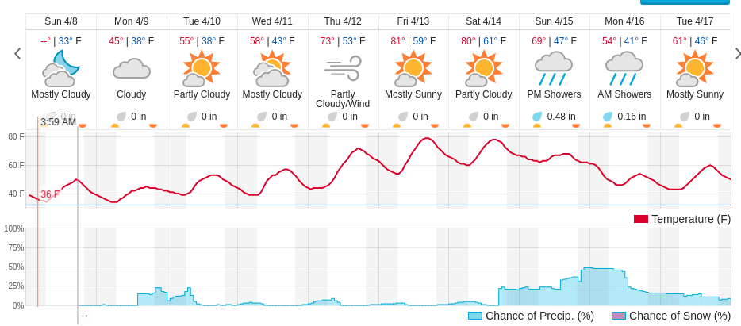
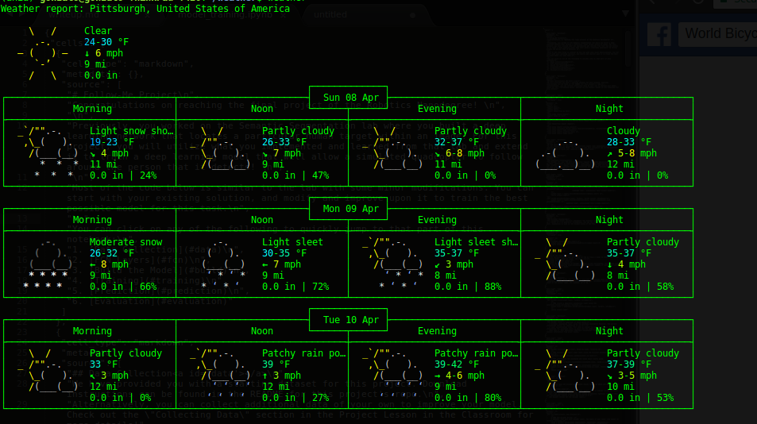

# Weather
The goal of this project is to display weather chart in terminal

Here is an example of the type of chart we want to display:

Here is what we would want the display to look like:

There are already a few ways to displaying weather in a terminal but this will display a 10 day temperature and precipitation forecast in a concise easy to read format. 